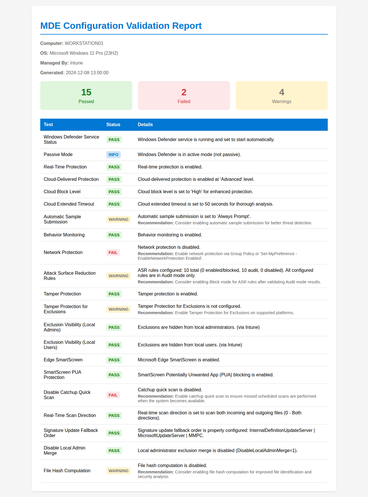

# MDEValidator

[](https://www.powershellgallery.com/packages/MDEValidator)
[](https://www.powershellgallery.com/packages/MDEValidator)
[](https://github.com/NateHutch365/MDEValidator/actions/workflows/ci.yml)
[](https://github.com/NateHutch365/MDEValidator/blob/main/LICENSE)

A PowerShell module to validate Microsoft Defender for Endpoint (MDE) configurations and security settings on Windows endpoints.

## Requirements

- Windows 10/11 or Windows Server 2016+
- PowerShell 5.1 or later
- Windows Defender Antivirus installed
- Administrator privileges (recommended for full functionality)

## Installation

### Install from PowerShell Gallery

MDEValidator is published to [PowerShell Gallery](https://www.powershellgallery.com/packages/MDEValidator).

```powershell
Install-Module -Name MDEValidator -Scope CurrentUser
```

> **Scope:** `-Scope CurrentUser` installs for your account only and does not require administrator privileges.
> To install for all users on a shared machine, use `-Scope AllUsers` from an elevated (Run as Administrator) PowerShell session:
>
> ```powershell
> Install-Module -Name MDEValidator -Scope AllUsers
> ```

### Verify the Installation

After installation, confirm the module is available:

```powershell
Get-Module -Name MDEValidator -ListAvailable
```

You should see `MDEValidator` listed with its version number. If the module is not listed, open a new PowerShell session and run the command again.

> If `Install-Module` fails, see [Troubleshooting](#troubleshooting) for common enterprise issues (NuGet provider, execution policy, TLS 1.2, repository trust, and scope).

## Quick Start

```powershell
# Step 1: Import the module
Import-Module MDEValidator

# Step 2: Run your first validation report
Get-MDEValidationReport
```

For additional options:

```powershell
# Include MDE onboarding status check
Get-MDEValidationReport -IncludeOnboarding

# Generate an HTML report
Get-MDEValidationReport -OutputFormat HTML -OutputPath "C:\Reports\MDEReport.html"

# Return results as PowerShell objects for automation
$results = Get-MDEValidationReport -OutputFormat Object
$results | Where-Object { $_.Status -eq 'Fail' }

# Return the full report as a JSON string (includes metadata, summary, and results[])
Get-MDEValidationReport -OutputFormat JSON

# Run only specific test categories (skips other tests entirely — faster)
Get-MDEValidationReport -Category 'Tamper Protection', 'Device State'
```

## Usage

### Available Functions

#### Get-MDEValidationReport

Runs all validation tests and generates a formatted report. Supports four output formats: `Console` (default), `HTML`, `JSON`, and `Object`.

```powershell
# Console output (default)
Get-MDEValidationReport

# HTML report saved to file
Get-MDEValidationReport -OutputFormat HTML -OutputPath "C:\Reports\MDEReport.html"

# PowerShell objects for further processing
$results = Get-MDEValidationReport -OutputFormat Object
$results | Where-Object { $_.Status -eq 'Fail' }

# JSON string returned to the pipeline
$json = Get-MDEValidationReport -OutputFormat JSON

# JSON written to file — returns the saved file path
Get-MDEValidationReport -OutputFormat JSON -OutputPath "C:\Reports\MDEReport.json"
```

**JSON envelope structure:**

```json
{
  "metadata": {
    "computerName": "WORKSTATION01",
    "os": "Windows 11 Enterprise 23H2",
    "managedBy": "Intune",
    "mdeOnboarding": "Onboarded",
    "generated": "2025-06-01T10:30:00.0000000+01:00",
    "moduleVersion": "1.4.0"
  },
  "summary": {
    "total": 38,
    "pass": 30,
    "fail": 2,
    "warning": 4,
    "info": 1,
    "notApplicable": 1
  },
  "results": [
    {
      "TestName": "Real-Time Protection",
      "Category": "Device State",
      "Status": "Pass",
      "Message": "Real-time protection is enabled.",
      "Expected": "Enabled",
      "Actual": "Enabled",
      "Recommendation": "",
      "Timestamp": "2025-06-01T10:30:01.1234567+01:00"
    }
  ]
}
```

**Filtering:** Use `-Category` to run only specific test categories (tests are skipped before invocation for a performance win). Use `-ExcludeTest` to remove results by TestName wildcard pattern after the run.

```powershell
# Run only Tamper Protection and Device State checks
Get-MDEValidationReport -Category 'Tamper Protection', 'Device State'

# Exclude all SmartScreen tests
Get-MDEValidationReport -OutputFormat Object -ExcludeTest '*SmartScreen*'

# Combine category filter and specific exclusion
Get-MDEValidationReport -Category 'Protection Settings' -ExcludeTest 'Antispyware Signature Age'
```

Valid `-Category` values: `Device State`, `Protection Settings`, `Onboarding`, `Network Protection`, `ASR Rules`, `Tamper Protection`, `Exclusion Settings`.

#### Test-MDEConfiguration

Runs all validation tests and returns results as PowerShell objects.

```powershell
# Run all basic tests
$results = Test-MDEConfiguration

# Include MDE onboarding status check
$results = Test-MDEConfiguration -IncludeOnboarding

# Include policy registry verification sub-tests
$results = Test-MDEConfiguration -IncludePolicyVerification

# Combine both options
$results = Test-MDEConfiguration -IncludeOnboarding -IncludePolicyVerification

# Run only specific categories (tests outside the category are not invoked)
$results = Test-MDEConfiguration -Category 'ASR Rules', 'Network Protection'

# Exclude specific tests after the run (wildcards supported)
$results = Test-MDEConfiguration -ExcludeTest '*SmartScreen*', 'Antispyware Signature Age'
```

**Note on -IncludePolicyVerification**: When `HideExclusionsFromLocalAdmins` is enabled via Intune, it restricts SYSTEM/Administrator access to the entire Intune policy registry path (`HKLM:\SOFTWARE\Policies\Microsoft\Windows Defender\Policy Manager`). This means policy verification sub-tests will not be able to access the registry to verify policy values when this security feature is enabled.

To identify if this limitation applies to your environment:
- Check if exclusions appear as "{N/A: Administrators are not allowed to view exclusions}" when running `Get-MpPreference`
- If you receive "Access Denied" errors when attempting to read the Intune Policy Manager registry path
- If you're managing Windows Defender via Intune with `HideExclusionsFromLocalAdmins` enabled

Note: This limitation only affects Intune-managed devices with this specific security setting enabled. GPO/SCCM/SSM-managed devices can use `-IncludePolicyVerification` without restrictions.

#### Individual Test Functions

You can run individual tests for specific validations:

```powershell
# Core Defender Status
Test-MDEServiceStatus
Test-MDEPassiveMode

# Protection Features
Test-MDERealTimeProtection
Test-MDECloudProtection
Test-MDECloudBlockLevel
Test-MDECloudExtendedTimeout
Test-MDESampleSubmission
Test-MDEBehaviorMonitoring
Test-MDENetworkProtection
Test-MDENetworkProtectionWindowsServer
Test-MDEDatagramProcessingWindowsServer
Test-MDEAutoExclusionsWindowsServer

# MDE Advanced Features
Test-MDEOnboardingStatus
Test-MDEDeviceTags
Test-MDEAttackSurfaceReduction
Test-MDEThreatDefaultActions
Test-MDETamperProtection
Test-MDETamperProtectionForExclusions

# Exclusion Visibility
Test-MDEExclusionVisibilityLocalAdmins
Test-MDEExclusionVisibilityLocalUsers

# Edge SmartScreen Policies
Test-MDESmartScreen
Test-MDESmartScreenPUA
Test-MDESmartScreenPromptOverride
Test-MDESmartScreenDownloadOverride
Test-MDESmartScreenDomainExclusions
Test-MDESmartScreenAppRepExclusions

# Scan and Update Configuration
Test-MDEDisableCatchupQuickScan
Test-MDERealTimeScanDirection
Test-MDESignatureUpdateFallbackOrder
Test-MDESignatureUpdateInterval
Test-MDEFileHashComputation

# Policy Management
Test-MDEDisableLocalAdminMerge

# Policy Verification (helper functions)
Test-MDEPolicyRegistryValue
Test-MDEPolicyRegistryVerification
```

### Result Object

Every validation function returns a `PSCustomObject` with these properties:

| Property | Type | Description |
|---|---|---|
| `TestName` | string | Human-readable test name (e.g. `Real-Time Protection`) |
| `Category` | string | Test category — one of the 7 standard categories, or `Policy Verification` for policy registry sub-tests |
| `Status` | string | `Pass`, `Fail`, `Warning`, `Info`, or `NotApplicable` |
| `Message` | string | Describes the observed configuration state |
| `Expected` | string | The recommended or expected value |
| `Actual` | string | The observed value (may be empty if the check could not query) |
| `Recommendation` | string | Remediation guidance — present only on `Fail`/`Warning` results |
| `Timestamp` | datetime | When the check was executed |

Example — show failures with expected vs actual:

```powershell
$results = Test-MDEConfiguration
$results | Where-Object Status -eq 'Fail' |
    Select-Object TestName, Expected, Actual, Recommendation |
    Format-Table -AutoSize
```

### Interpreting Policy Verification Results

When `-IncludePolicyVerification` is specified, each supported test gains an additional sub-test named `<TestName> - Policy Registry Verification`. These sub-tests confirm that `Get-MpPreference` settings are backed by a management policy in the registry.

**Registry paths checked** (determined automatically by device management type):
- **Intune:** `HKLM:\SOFTWARE\Policies\Microsoft\Windows Defender\Policy Manager`
- **GPO / SCCM / Security Settings Management (SSM):** `HKLM:\SOFTWARE\Policies\Microsoft\Windows Defender`

**Sub-test status meanings:**

| Status | Meaning |
|---|---|
| `Pass` | Registry entry found at the expected path with the expected value |
| `Warning` | Registry entry not found — policy may not be deployed, or a sync issue exists |
| `NotApplicable` | Test is not applicable to SSM (e.g. Exclusion Visibility settings) — only Antivirus, ASR, EDR, and Firewall policies are supported by SSM |
| `Info` | Device management type could not be determined; verification was skipped |

Policy verification sub-tests always carry `Category = 'Policy Verification'` and appear after the 7 standard category sections in the HTML report.

### Output Example

Console output:

```
========================================
  MDE Configuration Validation Report
  Generated: 2024-01-15 10:30:45
  Computer: WORKSTATION01
========================================

[PASS] Windows Defender Service Status
         Windows Defender service is running and set to start automatically.

[INFO] Passive Mode
         Windows Defender is in active mode (not passive).

[PASS] Real-Time Protection
         Real-time protection is enabled.

[PASS] Cloud-Delivered Protection
         Cloud-delivered protection is enabled at 'Advanced' level.

[PASS] Cloud Block Level
         Cloud block level is set to 'High' for enhanced protection.

[PASS] Cloud Extended Timeout
         Cloud extended timeout is set to 50 seconds for thorough analysis.

[WARN] Automatic Sample Submission
         Automatic sample submission is set to 'Always Prompt'.
         Recommendation: Consider enabling automatic sample submission for better threat detection.

[PASS] Behavior Monitoring
         Behavior monitoring is enabled.

[FAIL] Network Protection
         Network protection is disabled.
         Recommendation: Enable network protection via Group Policy or 'Set-MpPreference -EnableNetworkProtection Enabled'.

[WARN] Attack Surface Reduction Rules
         ASR rules configured: 10 total (0 enabled/blocked, 10 audit, 0 disabled). All configured rules are in Audit mode only.
         Recommendation: Consider enabling Block mode for ASR rules after validating Audit mode results.

[PASS] Tamper Protection
         Tamper protection is enabled.

[WARN] Tamper Protection for Exclusions
         Tamper Protection for Exclusions is not configured.
         Recommendation: Enable Tamper Protection for Exclusions on supported platforms.

[PASS] Exclusion Visibility (Local Admins)
         Exclusions are hidden from local administrators. (via Intune)

[PASS] Exclusion Visibility (Local Users)
         Exclusions are hidden from local users. (via Intune)

[PASS] Edge SmartScreen
         Microsoft Edge SmartScreen is enabled.

[PASS] Disable Local Admin Merge
         Local administrator exclusion merge is disabled (DisableLocalAdminMerge=1).

========================================
  Summary: 11/16 Passed
  Passed: 11 | Failed: 1 | Warnings: 3 | Info: 1
========================================
```

HTML report output:



### Test Status Values

| Status | Description |
|--------|-------------|
| Pass | The configuration meets recommended security standards |
| Fail | The configuration does not meet security requirements |
| Warning | The configuration is partially compliant or could be improved |
| Info | Informational message about the configuration |
| NotApplicable | The test is not applicable to this system |

## Automation

### -AsExitCode — numeric exit codes for automated workflows

Pass `-AsExitCode` to any `Get-MDEValidationReport` call to replace the normal return value with `[int]` — the count of `Fail` results (0 = fully compliant). All other side-effects (console output, file writes) still occur normally.

```powershell
# Basic usage — exit with the fail count
exit (Get-MDEValidationReport -AsExitCode)

# Write a JSON report AND exit with the fail count
exit (Get-MDEValidationReport -OutputFormat JSON -OutputPath "C:\Reports\MDEReport.json" -AsExitCode)
```

#### Scheduled Task (detect non-compliant state)

Use the following as the scheduled task action (Program: `powershell.exe`):

```
-NonInteractive -ExecutionPolicy Bypass -Command "Import-Module MDEValidator; exit (Get-MDEValidationReport -OutputFormat JSON -OutputPath 'C:\Logs\MDEReport.json' -AsExitCode)"
```

The task's last-run result will be non-zero when any test fails, making it easy to monitor via Task Scheduler or event log.

#### Intune Proactive Remediation — detection script

```powershell
#Requires -Version 5.1
Import-Module MDEValidator -ErrorAction Stop

$failCount = Get-MDEValidationReport `
    -OutputFormat JSON `
    -OutputPath "$env:ProgramData\MDEValidator\report.json" `
    -AsExitCode

if ($failCount -gt 0) {
    Write-Host "Non-compliant: $failCount test(s) failed."
    exit 1   # Triggers the remediation script in Intune
}

Write-Host "Compliant: all tests passed."
exit 0
```

#### CI pipeline (GitHub Actions / Azure DevOps)

```yaml
- name: Validate MDE configuration
  shell: pwsh
  run: |
    Import-Module ./MDEValidator/MDEValidator.psd1
    $fails = Get-MDEValidationReport -OutputFormat JSON -OutputPath mde-report.json -AsExitCode
    exit $fails   # Non-zero exit fails the pipeline step
```

Upload `mde-report.json` as a pipeline artifact to preserve results across runs.

## Troubleshooting

### 1. NuGet Provider Not Installed

**Symptom:** `Install-Module` prompts "NuGet provider is required" or fails in a non-interactive session.

**Fix:** Install the NuGet provider explicitly before retrying:

```powershell
Install-PackageProvider -Name NuGet -MinimumVersion 2.8.5.201 -Force -Scope CurrentUser
```

Then re-run `Install-Module -Name MDEValidator -Scope CurrentUser`.

---

### 2. Execution Policy Blocks Import

**Symptom:** `Import-Module` fails with "running scripts is disabled on this system."

**Fix:** Set the execution policy for your user account (does not require administrator):

```powershell
Set-ExecutionPolicy -ExecutionPolicy RemoteSigned -Scope CurrentUser
```

---

### 3. TLS 1.2 Connection Failure (Windows Server 2016 / PowerShell 5.1)

**Symptom:** `Install-Module` fails with "Could not establish trust relationship" or "underlying connection was closed."

**Fix:** Force TLS 1.2 for the current session, then retry the install:

```powershell
[Net.ServicePointManager]::SecurityProtocol = [Net.SecurityProtocolType]::Tls12
Install-Module -Name MDEValidator -Scope CurrentUser
```

---

### 4. Untrusted Repository Prompt

**Symptom:** `Install-Module` asks "Are you sure you want to install from 'PSGallery'?" and you cannot respond interactively (automation, RDP, non-interactive session).

**Fix (trust PSGallery for the current session):**

```powershell
Set-PSRepository -Name PSGallery -InstallationPolicy Trusted
Install-Module -Name MDEValidator -Scope CurrentUser
```

**Alternative (single non-interactive command):**

```powershell
Install-Module -Name MDEValidator -Scope CurrentUser -Repository PSGallery -Force
```

---

### 5. Scope: CurrentUser vs AllUsers

**Symptom:** Module installed with `-Scope CurrentUser` is not available for other users on a shared machine. Or: `-Scope AllUsers` fails with "Access Denied."

**Fix:** Use `-Scope AllUsers` from an elevated (Run as Administrator) PowerShell session:

```powershell
Install-Module -Name MDEValidator -Scope AllUsers
```

`-Scope CurrentUser` (the default recommendation) does not require elevation and installs only for the current user profile.

## Updating and Uninstalling

### Update to the Latest Version

```powershell
Update-Module -Name MDEValidator
```

### Uninstall

```powershell
Uninstall-Module -Name MDEValidator
```

## Features

- **Service Status Validation**: Checks if Windows Defender service is running and configured properly
- **Passive Mode Detection**: Validates Windows Defender passive mode status
- **Real-Time Protection**: Validates that real-time protection is enabled
- **Cloud-Delivered Protection**: Verifies cloud-delivered protection (MAPS) settings
- **Cloud Block Level**: Checks cloud block level configuration for immediate blocking
- **Cloud Extended Timeout**: Validates extended cloud check timeout settings
- **Automatic Sample Submission**: Checks sample submission configuration
- **Behavior Monitoring**: Validates behavior monitoring status
- **MDE Onboarding Status**: Verifies device onboarding to Microsoft Defender for Endpoint
- **MDE Device Tags**: Lists any locally added MDE tags
- **Network Protection**: Checks network protection configuration
- **Network Protection (Windows Server)**: Validates network protection on Windows Server editions
- **Datagram Processing (Windows Server)**: Checks datagram processing configuration on Windows Server
- **Auto Exclusions for Servers**: Checks if DisableAutoExclusions is enabled on Windows Server (Pass if enabled, Warning if not)
- **Attack Surface Reduction (ASR) Rules**: Validates ASR rules configuration
- **Threat Default Actions**: Checks default actions for threat severity levels (Low, Moderate, High, Severe) showing both registry values and settings (e.g., 2 (Quarantine))
- **Tamper Protection**: Validates tamper protection status
- **Tamper Protection for Exclusions**: Checks if Tamper Protection for Exclusions is properly configured
- **Exclusion Visibility**: Validates settings that control whether local users and administrators can view exclusions (configurable via Group Policy or Intune)
- **Edge SmartScreen Policies**: Comprehensive validation of Microsoft Edge SmartScreen settings including:
  - SmartScreen enablement
  - Potentially Unwanted Applications (PUA) blocking
  - User override controls for prompts
  - User override controls for downloads
  - Domain exclusions
  - Application reputation exclusions
- **Catchup Quick Scan**: Validates that catchup quick scan is enabled to ensure missed scheduled scans are performed
- **Real-Time Scan Direction**: Checks scan direction settings (incoming/outgoing/both)
- **Signature Update Settings**: Validates signature update fallback order and interval
- **Disable Local Admin Merge**: Checks if local administrator exclusion merging is disabled
- **File Hash Computation**: Validates file hash computation settings
- **Policy Registry Verification**: Optional verification that Get-MpPreference settings match registry/policy entries based on management type (Intune, GPO, SCCM, SSM)
- **Multiple Output Formats**: Console, HTML, JSON (with structured envelope), and PowerShell object output options
- **Category and Test Filtering**: Use `-Category` to restrict test invocation to specific categories (perf win) or `-ExcludeTest` with wildcards to exclude individual results
- **Automation-Friendly Exit Codes**: `-AsExitCode` returns the Fail count as `[int]` for scheduled tasks, Intune Proactive Remediation, and CI pipelines

## Contributing

Contributions are welcome! Please read [CONTRIBUTING.md](CONTRIBUTING.md) for the full checklist when adding a new validation check, including test patterns, category wiring, and script analyser requirements.

### Development Setup

Clone the repository and import the module directly for local development:

```powershell
git clone https://github.com/NateHutch365/MDEValidator.git
Import-Module .\MDEValidator\MDEValidator.psd1
```

### Running Tests

The module includes Pester 5 tests for all validation functions:

```powershell
# Install Pester if not already installed
Install-Module -Name Pester -Force -SkipPublisherCheck

# Run the full test suite (coverage report written to Tests/Artifacts/)
.\run-tests.ps1
```

Individual test files live in `Tests/Public/<FunctionName>.Tests.ps1`. See [CONTRIBUTING.md](CONTRIBUTING.md) for the test authoring guide.

## License

This project is licensed under the MIT License. All content is free to use, modify, and distribute under the terms of the MIT License.

## Disclaimer

This tool is provided as-is for validation purposes. Always verify configurations against your organization's security policies and Microsoft's official documentation.
